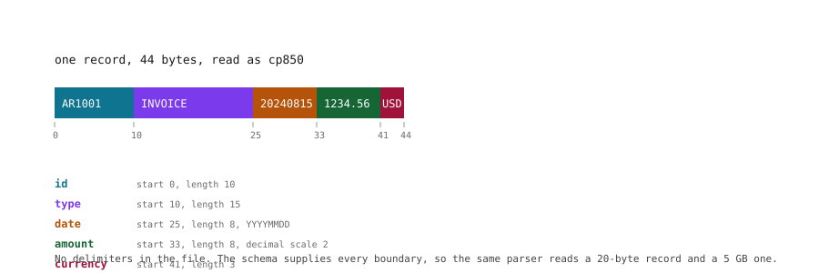
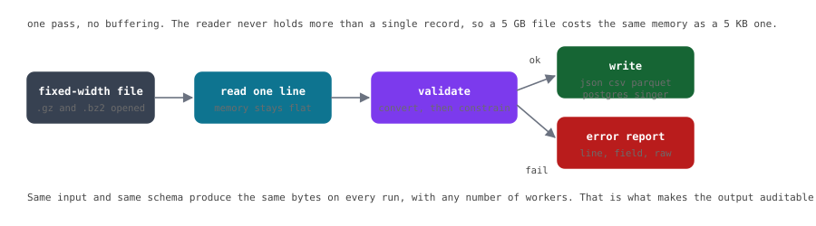
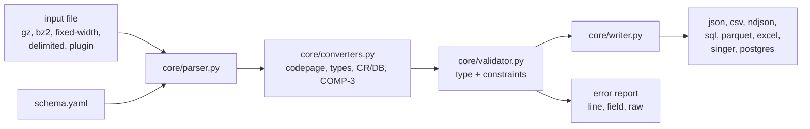

# erp-export-normalizer

[](https://github.com/lucasgiurastante/erp-export-normalizer/actions/workflows/ci.yml)
[](https://pypi.org/project/erp-export-normalizer/)

Legacy ERP exports come out of a mainframe as fixed-width binary with no
delimiters, one record per line, in a codepage nobody remembers. This reads
them and writes JSON, CSV, Parquet, Excel or a database table, validating as it
goes and reporting every bad line with its number, its field and the bytes that
caused it.

It streams. A 5 GB file costs the same memory as a 5 KB one. It has no
dependencies beyond PyYAML, opens no sockets, and writes nothing you did not
ask for. The same input and the same schema always produce the same bytes, which
is the whole point when the output has to survive an audit.

## How a record becomes a row

The file has no separators. The schema supplies every boundary:



```
format: jde_fixed_width
record_length: 44
codepage: cp850
fields:
  - {name: id,       start: 0,  length: 10}
  - {name: type,     start: 10, length: 15}
  - {name: date,     start: 25, length: 8,  type: date,    format: YYYYMMDD}
  - {name: amount,   start: 33, length: 8,  type: decimal, scale: 2, align: right}
  - {name: currency, start: 41, length: 3}
```

One generic parser reads that, and any other layout you can describe. Delimited
files work the same way with `delimiter: ","` instead of offsets.

## The pipeline



The reader holds one record at a time. Records that pass go to the writer;
records that fail go to the report. Nothing else is buffered, which is why
memory does not grow with file size and why `--workers 4` produces the same
bytes as `--workers 1`.

## What it does

**Reading.** Fixed-width by byte offset, or delimited by comma, tab,
semicolon or pipe, with optional header rows. Fields decode per field, so a
CP850 export and a UTF-8 export can sit in the same schema. `utf-8`, `cp850`,
`cp1252`, `latin-1` and `ebcdic-cp037` are supported. `.gz` and `.bz2` inputs
are decompressed on the way in, detected by their magic bytes rather than
their extension.

**Mainframe formats.** `type: packed` decodes COMP-3 BCD decimals, and credit
and debit suffixes (`1234.56CR`, `1234.56DB`) are understood, which is how
JD Edwards writes signed amounts. `copybook` imports a COBOL copybook's
`FD`/`PIC` clauses straight into a schema, so the layout stays in the client's
own source instead of being retyped.

**Validation.** Every line is checked, and checks do not stop at the first
failure. Beyond type conversion there are per-field constraints (`required`,
`min`, `max`, `pattern`, `enum`), duplicate key detection with `--key`, an empty
input check with `--fail-on-empty`, and schema-level `sum` and `balance` rules
that run in constant memory.

**Output.** JSON, CSV, NDJSON, SQL inserts, Parquet (exact `decimal128` for
money), Excel with real numeric and date cells, a Singer tap with a resumable
`STATE`, and a direct Postgres load where amounts stay `numeric`.

**Comparing exports.** `crosscheck` reconciles two or more files on totals, row
counts, key sets and referential integrity, so an invoice line pointing at a
customer that does not exist fails the run. `diff` reports what changed between
two exports, down to the field.

**Schemas.** Ten built-in layouts, auto-detection when you omit `--schema`,
`generate-schema` to infer one from an example file, and a versioned registry
index with checksums you can search and verify offline.

**DataFrames and the web.** `read_erp()` loads straight into Pandas, Polars or
Spark. `serve` starts a local interface for schema generation and conversion
preview, stdlib only, on `127.0.0.1`.

**Custom binary parsers.** Drop a Python `Reader` in a directory, point
`--plugins-dir` at it and name it from the schema with `parser: <module>`.
Validation, error reporting and determinism still apply. The contract is
frozen in [docs/PLUGIN_API_v1.md](docs/PLUGIN_API_v1.md).

**Audit evidence.** `--checksum` writes a sidecar with the input and output
hashes, schema version, counts and timestamp. CI gates on a relative performance
baseline and on an absolute determinism check across worker configurations.

## Try it now

```bash
pip install erp-export-normalizer
git clone https://github.com/lucasgiurastante/erp-export-normalizer
cd erp-export-normalizer/examples

# JD Edwards export (fixed-width, CP850) -> JSON, no config needed
erp-normalize --input data/jde_ar.txt --output - --format json

# COBOL mainframe dump (EBCDIC) -> NDJSON; decoding happens automatically
erp-normalize --input data/cobol.txt --output - --format ndjson

# binary length-prefixed frames via the bundled plugin
erp-normalize --schema framed_schema.yaml --input data/framed.bin --output - --format ndjson
```

Sample data and the full command set live in
[`examples/`](examples/README.md). The full history is in
[CHANGELOG.md](CHANGELOG.md).


## Installation

Requires Python 3.10+.

```bash
python3 -m venv .venv
source .venv/bin/activate

pip install -e .                 # core: JSON, CSV, NDJSON, SQL
pip install -e ".[parquet]"      # + Parquet (pyarrow)
pip install -e ".[excel]"        # + Excel (openpyxl)
pip install -e ".[dataframe]"    # + read_erp() with Pandas and Polars
pip install -e ".[spark]"        # + read_erp(backend="spark") (pyspark, needs a JVM)
pip install -e ".[postgres]"     # + --postgres-dsn (psycopg)
pip install -e ".[dev]"          # + pytest, hypothesis, ruff, mypy, build, twine
pip install -e ".[all]"          # everything above
```

## Quick start

```bash
# validate and report errors without writing output
erp-normalize --schema core/formats/jde_ar.yaml --input export.txt --output /dev/null --dry-run

# convert to JSON
erp-normalize --schema core/formats/jde_ar.yaml --input export.txt --output export.json --format json

# convert to CSV
erp-normalize --schema core/formats/jde_ar.yaml --input export.txt --output export.csv --format csv

# auto-detect the schema from the built-in library (no --schema)
erp-normalize --input export.txt --output export.json

# more formats: NDJSON, SQL inserts, Parquet, Excel
erp-normalize --schema core/formats/jde_ar.yaml --input export.txt --output export.ndjson --format ndjson
erp-normalize --schema core/formats/jde_ar.yaml --input export.txt --output export.sql --format sql
erp-normalize --schema core/formats/jde_ar.yaml --input export.txt --output export.parquet --format parquet
erp-normalize --schema core/formats/jde_ar.yaml --input export.txt --output export.xlsx --format excel

# per-line diagnostics
erp-normalize --schema core/formats/jde_ar.yaml --input export.txt --output export.json --verbose --dry-run
```

### Schema generation, batch, and audit

```bash
# infer a delimited schema from an example file, then convert with it
erp-normalize generate-schema example.csv --output example_schema.yaml
erp-normalize --schema example_schema.yaml --input example.csv --output example.json

# batch-convert a whole directory of exports
erp-normalize --schema core/formats/jde_ar.yaml --input "exports/*.txt" --output-dir converted/ --format parquet

# parallel validation (byte-identical output to serial)
erp-normalize --schema core/formats/jde_ar.yaml --input big.txt --output big.json --workers 4

# audit evidence sidecar (<output>.sha256)
erp-normalize --schema core/formats/jde_ar.yaml --input export.txt --output export.json --checksum

# Singer tap stream (pipe into any Singer target)
erp-normalize --schema core/formats/jde_ar.yaml --input export.txt --output - --format singer | target-postgres

# resumable Singer tap: a STATE bookmark every 1000 records
erp-normalize --schema core/formats/jde_ar.yaml --input huge.txt \
  --output out.jsonl --format singer --state-every 1000
# ...the run died. Pick it up where the target left off:
erp-normalize --schema core/formats/jde_ar.yaml --input huge.txt \
  --output out.jsonl --format singer --state out.jsonl.state

# validate the schema library
erp-normalize registry core/formats/
# ...or check a versioned index: checksums + schema validity
erp-normalize registry verify registry.yaml
erp-normalize registry search registry.yaml cobol

# fail the run if a primary key repeats (line + first sighting reported)
erp-normalize --schema core/formats/jde_ar.yaml --input export.txt \
  --output out.json --key id

# an empty extract is almost always a broken feed, not a quiet day
erp-normalize --schema core/formats/jde_ar.yaml --input export.txt \
  --output out.json --fail-on-empty

# load straight into Postgres, streaming, amounts as numeric
pip install 'erp-export-normalizer[postgres]'
erp-normalize --schema core/formats/jde_ar.yaml --input export.txt \
  --postgres-dsn postgresql://user@host/db --batch-size 500

# zero-dependency web UI (generate schemas without touching YAML)
erp-normalize serve --port 8000
#   /         schema generation + conversion preview
#   /validate per-line error table with the offending raw value
```

### Normalizing and masking, per field

Legacy exports spell the same value several ways, and some fields cannot be
handed out as they are. Both are explicit, per field, and validated when the
schema loads:

```yaml
fields:
  - {name: customer, start: 0,  length: 20, trim: true, case: upper}
  - {name: cuit,     start: 20, length: 11, mask: partial, mask_keep: 3}
  - {name: doc,      start: 31, length: 12, mask: hash}
```

`normalize: NFKC` folds full-width characters and composed accents. `case`
and `normalize` only apply to `string` fields. Applying them to a decimal
would silently reorder what the schema says. A masked value is always
written as a string, so the audit trail cannot imply a number survived.

### Importing a COBOL copybook

The record layout usually already exists in the client's COBOL source. Import
it instead of retyping the offsets:

```bash
erp-normalize copybook CUSTFILE.cpy --output cust.yaml --name cust_export
erp-normalize --schema cust.yaml --input export.bin --output cust.json
```

The importer resolves `PIC` clauses and `USAGE` keywords:

| COBOL | schema field |
|---|---|
| `PIC X(20)` | `string`, 20 bytes |
| `PIC 9(8)` | `date` `YYYYMMDD` (or `decimal` with `--no-date`) |
| `PIC S9(7)V99 COMP-3` | `packed`, `scale: 2`, 5 bytes |
| `PIC S9(5) COMP` | `decimal`, machine-word width |

`V` is the implied decimal point, so `S9(7)V99` is 7 integer digits plus 2
decimals, so 9 positions. Only `(n)` repeats a position; the `99` after `V` is
two positions, not ninety-nine.

### Reconciling and diffing two exports

A file can pass every per-line check and still be wrong. `crosscheck` asks
whether two exports reconcile; `diff` asks what actually changed.

```bash
# do the statement and the ledger agree on totals, counts and keys?
erp-normalize crosscheck \
  core/formats/jde_ar.yaml=statement.txt \
  core/formats/jde_ar.yaml=ledger.txt \
  --key id --sum amount --checks count,sum:amount,unique,missing

# what changed between yesterday and today?
erp-normalize diff \
  core/formats/jde_ar.yaml=yesterday.txt \
  core/formats/jde_ar.yaml=today.txt \
  --key id --fields amount,date
```

```
added=1 removed=1 changed=1 identical=1
  + AR1004
  - AR1003
  ~ AR1001: amount: 1234.56 -> 1500
```

Both commands keep only one index of keys in memory, never the file itself,
and `--max-keys` makes them fail loudly rather than index without limit. They
exit `3` when something does not reconcile, so a pipeline can gate on them.
`--json` emits the report for machine consumption.

A conversion run prints a summary to stdout:

```
records: 3 | ok: 1 | errors: 2
```

and per-line diagnostics to stderr:

```
  line 2: field 'date': invalid date '20251301': month must be in 1..12, not 13
  line 3: length 17 != record_length 44; field 'type': out of range (short line)
```

## Schema format

`core/formats/jde_ar.yaml`, a JD Edwards Accounts Receivable export:

```yaml
format: jde_fixed_width
version: 1.0.0
description: "JD Edwards AR export (Accounts Receivable) - example schema"
record_length: 44
codepage: cp850
table: jde_ar_export
fields:
  - {name: id,       start: 0,  length: 10}
  - {name: type,     start: 10, length: 15}
  - {name: date,     start: 25, length: 8,  type: date,    format: YYYYMMDD}
  - {name: amount,   start: 33, length: 8,  type: decimal, scale: 2, align: right}
  - {name: currency, start: 41, length: 3}
```

Field attributes:

| Attribute   | Required | Meaning                                          |
|-------------|----------|--------------------------------------------------|
| `name`      | yes      | Output column name                               |
| `start`     | yes      | Zero-based byte offset                            |
| `length`    | yes      | Field width in bytes                             |
| `type`      | no       | `string` (default), `date`, `decimal`            |
| `format`    | no       | Date format, e.g. `YYYYMMDD` (required for dates)|
| `scale`     | no       | Decimal places for `decimal` (scaleb semantics)  |
| `align`     | no       | `left` (default) or `right`; padding is stripped  |
| `codepage`  | no       | Per-field codepage override                       |

Schema-level attributes: `format`, `version` (required), `record_length`
(required), `codepage` (default `utf-8`), `description`, and `table`; the
target SQL table name for the `sql` output (validated as an identifier,
defaults to `export`).

Schemas are validated at load time: required keys, duplicate names, overlapping
fields, and overflows past `record_length` are rejected with a clear message.

### Business rules

Rules run over all valid records in O(1) memory and are checked at the end;
violations exit with code 3 and print per-rule messages.

```yaml
rules:
  - {type: sum, field: amount, expected: 123456.78}   # control total
  - {type: balance, positive: debit, negative: credit} # debits = credits
```

### Custom parsers (plugins)

For formats the built-in readers cannot handle, such as binary records, framed
payloads, packed decimals. A plugin is a Python module in `core/plugin_examples/` exposing
a `Reader` class with a `records()` method yielding `(line_no, record_bytes)`
(the same contract as `parser.FixedWidthReader`). The schema selects it via
`parser`:

```yaml
format: framed
version: 1.0.0
parser: length_prefixed_frame   # core/plugin_examples/length_prefixed_frame.py
codepage: cp1252
fields:
  - {name: id,   start: 0,  length: 4}
  - {name: date, start: 4,  length: 8,  type: date, format: YYYYMMDD}
  - {name: amt,  start: 12, length: 8,  type: decimal, scale: 2, align: right}
```

Field `start`/`length` are advisory for plugins (the plugin decides how to
slice). `record_length` is not required. Validation still runs afterwards, so
plugins get the same cumulative error report and exit codes. Run with
`--plugins-dir` to use a non-default plugin directory.

The full contract is frozen and versioned in
[docs/PLUGIN_API_v1.md](docs/PLUGIN_API_v1.md): discovery, the mandatory
`Reader(schema, path)` signature, `records(skip_first=False)` yielding
`(lineno, bytes)`, raw-bytes semantics, the error contract (including wrapping
a bad constructor as `PluginError`), and the semver rules for `v1.x`. Read it
before publishing a third-party parser.

### DataFrame integration

```python
from core.io import read_erp

df = read_erp("export.txt", schema="core/formats/jde_ar.yaml")  # pandas
pl_df = read_erp("export.txt", backend="polars")  # auto-detect + polars
spark_df = read_erp("export.txt", backend="spark")  # explicit decimal128 schema
```

`on_error="ignore"` drops invalid records instead of raising. The Spark
backend imports lazily, so a JVM is needed only when it is called.

## Exit codes

| Code | Meaning                          |
|------|----------------------------------|
| 0    | Success                          |
| 1    | Runtime error (I/O)              |
| 2    | Invalid schema                   |
| 3    | Validation errors found          |

`crosscheck` and `diff` also exit `3` when the exports do not reconcile, and a
conversion exits `3` with `--fail-on-empty` when the input yields no records,
so a pipeline can gate on a single code. Without the flag an empty input still
exits `0`, but the run prints a warning saying whether the file was empty or
held records that were all rejected.

## Architecture



Everything is streaming, so the boxes that matter are the first two: the
parser yields one record at a time and the writer consumes it immediately.
Validation sits in between and never sees more than the current record either.

Beyond this diagram, [ARCHITECTURE.md](ARCHITECTURE.md) covers module
responsibilities, design rules and the phased roadmap, and
[docs/TECHNICAL_DESIGN.md](docs/TECHNICAL_DESIGN.md) goes into parsing
internals, conversion semantics and the reasoning behind each decision.

## Development

```bash
# test suite (stdlib unittest; pytest discovers it too)
python -m unittest discover -s tests -v
pytest

# what CI runs
ruff check .
ruff format --check .
mypy cli.py core

# performance profile
python scripts/perf_profile.py --lines 100000 \
  --baseline perf-baseline.json --tolerance 0.5
# refresh the committed baseline deliberately, not by accident
python scripts/perf_profile.py --lines 100000 --update-baseline perf-baseline.json
```

The performance gate is relative on purpose. Shared CI runners are noisy and an
absolute wall-clock threshold produces flaky failures nobody trusts. A baseline
recorded on a different machine is detected and the verdict is skipped rather
than failed, because the difference is hardware rather than code; pass
`--require-same-machine` to make that a hard error instead. The determinism
check runs the other way and never relaxes: every worker configuration has to
produce byte-identical output.

## Roadmap

| Phase | Scope | Status |
|---|---|---|
| 0 | Fixed-width to JSON and CSV, YAML schemas | Done |
| 1 | NDJSON, Parquet, Excel, SQL, auto-detection, schema library | Done |
| 2 | Parallel processing, batch globbing, schema inference, DataFrames | Done |
| 3 | Business rules, audit sidecars, schema registry, web UI | Done |
| 4 | Singer tap, Spark backend | Done, except hosted SaaS |
| 5 | Reconciliation, diffing, COBOL tooling | Done |

The centralized schema registry and a hosted SaaS are the two items still open,
and both are listed as out of scope in
[INSTRUCTIVO_AGENTE.md](INSTRUCTIVO_AGENTE.md#9-fuera-de-alcance-no-hacer). The
format a public registry would need is already written up in
[docs/RFC_REGISTRY.md](docs/RFC_REGISTRY.md), along with what it deliberately
does not solve.

## License

MIT. See [LICENSE](LICENSE).